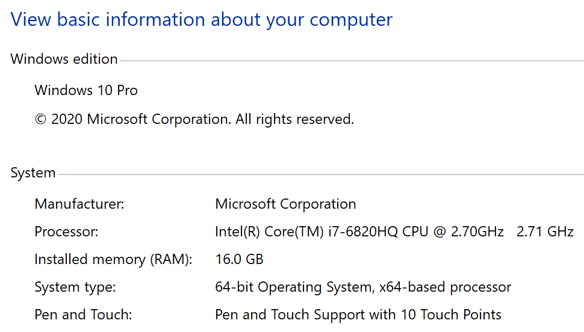

# Frank

[F#](https://fsharp.org/) [computation expressions](https://docs.microsoft.com/en-us/dotnet/fsharp/language-reference/computation-expressions), or builders, for configuring the [`Microsoft.AspNetCore.Hosting.IWebHostBuilder`](https://docs.microsoft.com/en-us/dotnet/api/microsoft.aspnetcore.hosting.iwebhostbuilder?view=aspnetcore-2.0) and defining routes for HTTP resources using [`Microsoft.AspNetCore.Routing`](https://docs.microsoft.com/en-us/aspnet/core/fundamentals/routing?view=aspnetcore-2.1).

This project was inspired by @filipw's [Building Microservices with ASP.NET Core (without MVC)](https://www.strathweb.com/2017/01/building-microservices-with-asp-net-core-without-mvc/).

---

## Builds

MacOS/Linux | Windows
--- | ---
[](https://travis-ci.org/frank-fs/frank) | [](https://ci.appveyor.com/project/panesofglass/frank)
[](https://travis-ci.org/frank-fs/frank/builds) | [](https://ci.appveyor.com/project/panesofglass/frank)

## Nuget 

Stable | Prerelease
--- | ---
[](https://www.nuget.org/packages/Frank/) | [](https://www.nuget.org/packages/Frank/)

## CodeScene

[ Get more details at **codescene.io**.](https://codescene.io/projects/4775/jobs/latest-successful/results)

---

## Building

Make sure the following **requirements** are installed in your system:

* [dotnet SDK](https://www.microsoft.com/net/download/core) 2.2 or higher

```
dotnet build
```

## Performance

Benchmarks should never be taken at face value. The following are taken from the [web-frameworks](https://github.com/the-benchmarker/web-frameworks) application, which simply returns an `""` with a `200 OK` response.
These benchmarks compare Frank, Falco, Giraffe, and Suave under a load of 2000 and 10000 concurrent requests for a duration of 10 seconds using [bombarider](https://github.com/codesenberg/bombardier).



Frank
```
C:\Users\ryanr\Code> .\bombardier-windows-amd64.exe http://127.0.0.1:5000 -c 2000
Bombarding http://127.0.0.1:5000 for 10s using 2000 connection(s)
[===========================================================================================================] 10s
Done!
Statistics        Avg      Stdev        Max
  Reqs/sec     74771.81   16274.70  213042.61
  Latency       27.06ms    14.99ms      1.17s
  HTTP codes:
    1xx - 0, 2xx - 735729, 3xx - 0, 4xx - 0, 5xx - 0
    others - 0
  Throughput:    11.76MB/s
C:\Users\ryanr\Code> .\bombardier-windows-amd64.exe http://127.0.0.1:5000 -c 10000
Bombarding http://127.0.0.1:5000 for 10s using 10000 connection(s)
[===========================================================================================================] 10s
Done!
Statistics        Avg      Stdev        Max
  Reqs/sec     66859.74   21516.50  135402.71
  Latency      154.69ms    70.68ms      2.31s
  HTTP codes:
    1xx - 0, 2xx - 636305, 3xx - 0, 4xx - 0, 5xx - 0
    others - 0
  Throughput:    10.06MB/s
```

Falco
```
C:\Users\ryanr\Code> .\bombardier-windows-amd64.exe http://127.0.0.1:5000 -c 2000
Bombarding http://127.0.0.1:5000 for 10s using 2000 connection(s)
[===========================================================================================================] 10s
Done!
Statistics        Avg      Stdev        Max
  Reqs/sec     68816.05   19014.03  260693.85
  Latency       29.49ms    16.89ms      1.14s
  HTTP codes:
    1xx - 0, 2xx - 675620, 3xx - 0, 4xx - 0, 5xx - 0
    others - 0
  Throughput:    13.43MB/s
C:\Users\ryanr\Code> .\bombardier-windows-amd64.exe http://127.0.0.1:5000 -c 10000
Bombarding http://127.0.0.1:5000 for 10s using 10000 connection(s)
[===========================================================================================================] 10s
Done!
Statistics        Avg      Stdev        Max
  Reqs/sec     61873.98   18588.41  144228.63
  Latency      167.55ms    80.43ms      2.63s
  HTTP codes:
    1xx - 0, 2xx - 585628, 3xx - 0, 4xx - 0, 5xx - 0
    others - 0
  Throughput:    11.50MB/s
```

Giraffe
```
C:\Users\ryanr\Code> .\bombardier-windows-amd64.exe http://127.0.0.1:5000 -c 2000
Bombarding http://127.0.0.1:5000 for 10s using 2000 connection(s)
[===========================================================================================================] 10s
Done!
Statistics        Avg      Stdev        Max
  Reqs/sec     70654.17   20454.63  161930.16
  Latency       28.69ms    27.63ms      1.68s
  HTTP codes:
    1xx - 0, 2xx - 695363, 3xx - 0, 4xx - 0, 5xx - 0
    others - 0
  Throughput:    12.89MB/s
C:\Users\ryanr\Code> .\bombardier-windows-amd64.exe http://127.0.0.1:5000 -c 10000
Bombarding http://127.0.0.1:5000 for 10s using 10000 connection(s)
[===========================================================================================================] 10s
Done!
Statistics        Avg      Stdev        Max
  Reqs/sec     64535.14   19824.63  191980.80
  Latency      159.96ms    92.95ms      2.67s
  HTTP codes:
    1xx - 0, 2xx - 615054, 3xx - 0, 4xx - 0, 5xx - 0
    others - 0
  Throughput:    11.29MB/s
```

Suave
```
C:\Users\ryanr\Code> .\bombardier-windows-amd64.exe http://127.0.0.1:3000 -c 2000
Bombarding http://127.0.0.1:3000 for 10s using 2000 connection(s)
[===========================================================================================================] 10s
Done!
Statistics        Avg      Stdev        Max
  Reqs/sec     47804.68   33925.73  251817.76
  Latency       42.40ms    47.92ms      2.30s
  HTTP codes:
    1xx - 0, 2xx - 475110, 3xx - 0, 4xx - 0, 5xx - 0
    others - 0
  Throughput:     8.77MB/s
C:\Users\ryanr\Code> .\bombardier-windows-amd64.exe http://127.0.0.1:3000 -c 10000
Bombarding http://127.0.0.1:3000 for 10s using 10000 connection(s)
[===========================================================================================================] 10s
Done!
Statistics        Avg      Stdev        Max
  Reqs/sec     38277.80   39849.83  225515.79
  Latency      244.58ms   223.99ms      4.42s
  HTTP codes:
    1xx - 0, 2xx - 396062, 3xx - 0, 4xx - 0, 5xx - 0
    others - 8568
  Errors:
    dial tcp 127.0.0.1:3000: connectex: No connection could be made because the target machine actively refused it. - 8568
  Throughput:     6.88MB/s
```
